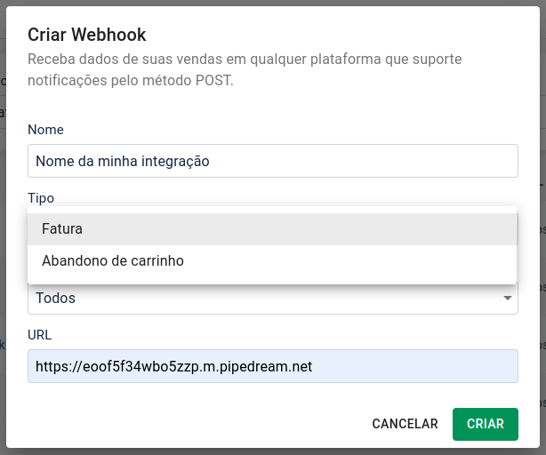

## Webhook Eduzz

o webhook eduzz permite que você receba notificações sobre alguns eventos que acontecem relacionados aos seus produtos na Eduzz.

### Configurando uma nova integração

Para configurar uma nova integração, basta conferir a **[tela de configuração de webhook](https://orbita.eduzz.com/producer/webhook)** no Órbita, lá, é possível cadastrar uma integração informando um nome, a url desejada, os dados de quais produtos devem serem disparados e qual o evento que você deseja receber.

### Autenticação

Para autenticar um **Webhook** na Eduzz, recomendamos o uso do campo chave de origem, disponível tanto no webhook quanto no serviço de **[Entrega Customizada](https://github.eduzz.com/eduzz/delivery_custom)**.

A chave para integração com o webhook pode ser visualizada em nossa plataforma no **[Órbita](https://orbita.eduzz.com/producer/config-api)**, ela será enviada no campo origin no payload do webhook.

**Ainda enviamos o campo api_key por motivos de compatibilidade, porém, ele não deve mais ser utilizado e será descontiunado em breve, para acesso a nossa [Api pública](https://api2.eduzz.com) deve ser utilizado o campo **[Api key](https://orbita.eduzz.com/producer/config-api)**, porém, depois de gerado, o mesmo não poderá mais ser visualizado.**

### Campos enviados para identificação e autenticação

Parâmetros | Descrição | Tipo
---------- | --------- | ----
origin     | **[Token](https://orbita.eduzz.com/producer/config-api)** de segurança do webhook | string
type       | Tipo da integração (invoice ou abandonment) | string

### Eventos disponíveis

- *Atualização de status de fatura e criação de contrato (invoice)*
- *Abandono de carrinho (abandonment)*

O tipo **(invoice || abandonment)** será enviado no campo de tipo do webhook **(type)**.

Quando utilizando o webhook, para que você possa receber as duas integrações, é necessário cadastrar duas vezes a mesma url para os tipos de fatura e abandono.

**[Documentação dos campos enviados no webhook de fatura](campos-fatura.md)**\
**[Exemplo de código para receber webhook de fatura](exemplo-fatura.php)**

**[Documentação dos campos enviados no webhook de abandono](campos-abandono)**\
**[Exemplo de código para receber webhook de abandono de carrinho](exemplo-abandono.php)**

---

### Suporte

Usuários com problemas no webhook podem utilizar o suporte através dos nossos canais de atendimento no **[Órbita](https://orbita.eduzz.com)**.