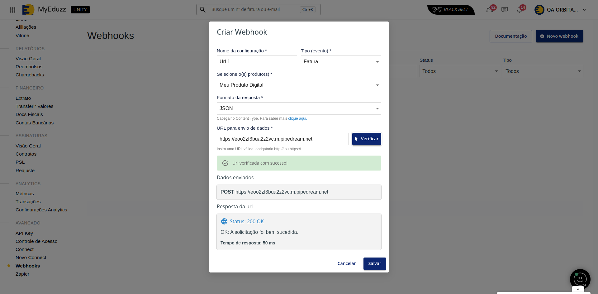

# Webhook Eduzz

O Webhook da Eduzz permite que você receba notificações sobre alguns eventos das suas vendas.

## Configurando uma nova integração

Para configurar uma nova integração, basta conferir a **[tela de configuração de webhook](https://orbita.eduzz.com/producer/webhook)** no Órbita, lá, é possível cadastrar uma integração, informando um nome, o tipo de evento que você quer receber, a url desejada, e quais os produtos devem serem enviados.

Os seguintes campos estão disponíveis para identificação da sua integração:

### Nome
Identifica a sua integração na listagem de webhooks no Órbita

### Tipo
Os seguintes eventos de webhook estão disponíveis:

**Fatura**: É enviado toda vez que um contrato ou uma fatura for atualizado, exemplo, toda vez que um contrato é criado, atualizado, etc, os eventos enviados estão disponíveis na **tabela de eventos**, os campos enviados podem serem conferidos na documentação dos **campos do evento de abandono de carrinho**.

**Abandono de carrinho**: É enviado toda vez que um novo abandono de carrinho é identificado, os campos disponíveis podem serem conferidos na documentação dos **campo do evento de abandono de carrinho**.

### Produtos

Os eventos de quais produtos devem serem enviados para aquela url

### Formato da resposta (Content-Type)

Qual será o formato em que os dados serão enviados na requisição http, os seguintes formatos estão disponíveis:

- **[application/json](https://developer.mozilla.org/en-US/docs/Learn/JavaScript/Objects/JSON)**
- **[x-www-form-urlencoded](https://developer.mozilla.org/en-US/docs/Web/HTTP/Methods/POST)**

## Teste

Após serem preenchidos os dados, a url pode ser testada para verificar se o cadastro foi feito corretamente.

Só será possível salvar se a URL retornar status padrão 200 ([https://developer.mozilla.org/en-US/docs/Web/HTTP/Status/200](https://developer.mozilla.org/en-US/docs/Web/HTTP/Status/200)).

## Autenticação

Para autenticar um **[Webhook](https://orbita.eduzz.com/producer/webhook)** na Eduzz, recomendamos o uso do campo chave de origem, disponível tanto no **[Webhook](https://orbita.eduzz.com/producer/webhook)** quanto no serviço de **[Entrega Customizada](https://github.eduzz.com/eduzz/delivery_custom)**.

A chave para integração com o webhook pode ser visualizada em nossa plataforma no **[Órbita](https://orbita.eduzz.com/producer/config-api)**, ela será enviada no campo origin no payload do webhook.

**Ainda enviamos o campo api_key por motivos de compatibilidade, porém, ele não deve mais ser utilizado e será descontiunado em breve.**

## Campos enviados para identificação e autenticação

Parâmetros | Descrição | Tipo
---------- | --------- | ----
origin     | **[Token](https://orbita.eduzz.com/producer/config-api)** de segurança do webhook | string
type       | Tipo da integração (invoice, contract ou abandonment) | string

## Identificando qual o evento que foi enviado

### Event Name (event_name)

O nome do evento que aconteceu será enviado no campo **event_name**.

Os seguintes valores pode serem enviados para cada tipo de url cadastrada:

**Fatura**

event_name | Momento do envio
--- | ---
invoice_open | Quando uma fatura é aberta (boleto é gerado ou uma nova transação de contrato é gerada)
invoice_processing | Fatura Está em processamento
invoice_paid | Fatura está paga
invoice_canceled | Fatura está cancelada
invoice_waiting_documents | Fatura está aguardando os documentos para processo de reembolso
invoice_waiting_refund | Reembolso foi aprovado e a fatura está agurdando ser reembolsada
invoice_refunded | Fatura foi reembolsada
invoice_analysing | Fatura está em análise
invoice_duplicated | Fatura foi identificada como duplicada e foi cancelada
invoice_expired | Data de pagamento da fatura expirou
invoice_recovering | Fatura entrou em recuperação de Vendas
invoice_trial | Fatura entrou em modo de trial
invoice_deleted | Fatura foi excluída, contatar time de Suporte
invoice_waiting_payment | Fatura está aguardando pagamento
invoice_refused | Cartão de crédito recusado no meio de pagamento
invoice_overdue | Fatura expirou
invoice_scheduled | Fatura está agendada para alguma data específica
invoice_negociated | Fatura entrou em disputa pelo cliente
contract_up_to_date | Enviado quando o contrato está em dia (foi pago e processado corretamente no último pagamento)
contract_waiting_payment | Contrato está aguardando o pagamento da parcela atual
contract_suspended | Contrato foi suspenso pela Eduzz ou produtor
contract_canceled | Contrato foi cancelado pela Eduzz ou produtor
contract_delayed | Contrato será processado no futuro
contract_finished | Contrato encerrado
contract_trial | Contrato entrou em modo trial
contract_overdue | Contrato entrou em atraso
contract_free | Contrato é gratuito

**Abandono de Carrinho**

event_name | Momento do envio
--- | ---
cart_abandonment | Toda vez que um cliente preenche os dados no checkout e abandono a compra

### Campo de tipo do evento (type)

- *Atualização de status de fatura e criação de contrato (invoice ou contract)*
- *Abandono de carrinho (abandonment)*

O tipo **(invoice, contract ou abandonment)** será enviado no campo **(type)**.

Quando utilizando o webhook, para que você possa receber as duas integrações, é necessário cadastrar duas vezes a mesma url para os tipos de fatura/contrato e abandono.

Type | Descrição
--------- | ----
abandonment | Um evento de abandono de carrinho, **[a documentação pode ser conferida aqui](campos-abandono.md)**
invoice | Um evento de alteração do status de uma fatura ou a criação de uma, **[a documentação pode ser conferida aqui](campos-fatura.md)**
contract | Um evento de alteração do status de um contrato ou a criação de um, **[a documentação pode ser conferida aqui](campos-fatura.md)**

## Documentação dos campos e exemplos

### **[Documentação dos campos enviados no webhook de fatura e contrato](campos-fatura.md)**
### **[Documentação dos campos enviados no webhook de abandono](campos-abandono.md)**

## Guia de solução de problemas

Sempre ocorrerá erro de envio quando a URL cadastrada pelo produtor no webhook retornar qualquer status diferente da faixa de **200-299**. [https://developer.mozilla.org/en-US/docs/Web/HTTP/Status](https://developer.mozilla.org/en-US/docs/Web/HTTP/Status)

Quando isso ocorrer o serviço de webhook da Eduzz irá realizar 10 tentativas de envio do evento que falhou para a URL, caso a falha continue será marcada como falhando a URL, e os eventos futuros serão armazenado em um backup.

O serviço de webhook continuará disparando o primeiro evento que falhou durante 2 dias, até que a URL do produtor seja reestabelecida, assim que esse disparo retornar status code 200 novamente, o webhook irá reativar a URL e buscar todos os eventos salvos no backup  disparando eles novamente por ordem da data em que os eventos aconteceram.

Caso continue falhando após os 5 dias, a URL será desativada, os eventos salvos serão excluídos e o produtor notificado.

## Suporte

Usuários com problemas no webhook podem utilizar o suporte através dos nossos canais de atendimento no **[Órbita](https://orbita.eduzz.com)**.
